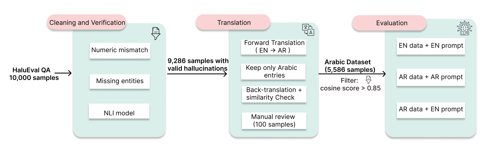

# Hallucination Detection in Arabic: Evaluating Large Language Models with HaluEval

This is the repository for our paper:

**Can Large Language Models Reliably Judge Hallucinations in Arabic? A
Controlled Study of Prompt and Content Language**

The repository contains:

* The code for constructing the final Arabic HaluEval QA dataset used for evaluation containing 5,586 samples.
* The code for evaluating large language models as hallucination judges.
* The code for analyzing evaluation results.

## Overview

<p align="center">
  
</p>

<p align="center">
  <em>Figure 1: Overview of the dataset construction and evaluation pipeline. Starting from the HaluEval QA dataset, samples are first cleaned and verified to remove invalid hallucination annotations. The remaining samples are then translated into Arabic, filtered for Arabic-script entries, checked using back-translation and semantic similarity, and manually reviewed. The final Arabic dataset is evaluated under three language configurations: En+En, Ar+Ar, and En+Ar.</em>
</p>


This repository builds on the QA subset of HaluEval, a hallucination evaluation benchmark based on knowledge-grounded question answering.

Each QA sample contains a knowledge passage, a question, a supported answer, and a hallucinated answer. The task is to evaluate whether a large language model can decide if a candidate answer is supported by the given knowledge.

For this project, we refine the original English HaluEval QA data and construct an Arabic version of the benchmark. The pipeline includes dataset cleaning, Arabic translation, script filtering, back-translation, semantic similarity filtering, and manual validation.

The final benchmark is used to evaluate multilingual and Arabic-oriented LLMs as hallucination judges under different language settings.

## Data Release

The `data` directory contains the datasets used in this project, including the original HaluEval QA data, the cleaned English data, the translated Arabic data, and the final filtered benchmark files.

The main data files are organized as follows:

```text
data/
├── original/
│   └── halu_eval_qa.json
│
├── cleaned/
│   ├── qa_data_cleaned.json
│   ├── removed_not_hallucinations.json
│   └── all_classification_results.jsonl
│
├── arabic/
│   ├── intermediate/
│   │   ├── qa_data_arabic.json
│   │   ├── qa_data_backtranslated.json
│   │   ├── semantic_similarity_results.json
│   │   └── semantic_similarity_results_0_85.json
│   ├── manual_review/
│   │   ├── annotation_forms/
│   │   └── samples/
│   ├── translation_model_selection/
│   │   ├── gpt4o/
│   │   ├── gpt4o_mini/
│   │   ├── pilot_100_original.json
│   │   └── pilot_model_comparison_summary.json
│   └── final/
│       ├── final_arabic_dataset.json
│       └── final_english_dataset.json
│
└── evaluation/
```

The original HaluEval QA file contains 10,000 knowledge-grounded question-answering samples. Each sample dictionary contains the following fields:

* `knowledge`: the evidence passage.
* `question`: the question.
* `right_answer`: the answer supported by the evidence.
* `hallucinated_answer`: the generated hallucinated answer.

The cleaned English dataset removes samples where the hallucinated answer is likely supported by the evidence. The final Arabic dataset contains the translated and filtered Arabic samples used for evaluation.

## Data Construction Process

We construct the Arabic hallucination detection benchmark in two main stages: dataset cleaning and Arabic translation with filtering.

### 1. Dataset Cleaning

We first clean the original HaluEval QA dataset to remove samples where the hallucinated answer is likely not a valid hallucination.

The cleaning step uses:

* numeric mismatch checks,
* missing-entity checks,
* an NLI-based entailment check.

Samples predicted as entailed by the provided knowledge are removed. The remaining samples are kept as valid hallucination examples.

```bash
cd src/cleaning
python clean_with_nli.py
```

The cleaned dataset is saved to:

```text
data/cleaned/qa_data_cleaned.json
```

The removed samples are saved to:

```text
data/cleaned/removed_not_hallucinations.json
```

### 2. Arabic Translation and Filtering

After cleaning, the English samples are translated into Arabic. The translated dataset is then filtered to ensure that the Arabic samples preserve the meaning of the original English data.

The filtering process includes:

* Arabic-script filtering,
* back-translation into English,
* semantic similarity comparison,
* manual validation.

```bash
cd src/translation
python translate_to_arabic.py
python backtranslate.py
python filter_by_similarity.py
```
The intermediate Arabic translation files are stored in the [`data/arabic/intermediate`](data/arabic/intermediate) directory. This directory contains files created during translation, back-translation, and semantic similarity filtering before the final dataset is produced.

The translation model selection files are stored in the [`data/arabic/translation_model_selection`](data/arabic/translation_model_selection) directory. This directory contains the pilot samples and comparison outputs used to select the translation model, comparing GPT-4o and GPT-4o mini.

The manual review files are stored in the [`data/arabic/manual_review`](data/arabic/manual_review) directory. This directory contains the 100 sampled examples and the annotation files from three manual reviewers used to validate translation quality.

The final benchmark files are as follows:

- [`final_arabic_dataset.json`](data/arabic/final/final_arabic_dataset.json): Final Arabic HaluEval QA benchmark used for evaluation.
- [`final_english_dataset.json`](data/arabic/final/final_english_dataset.json): Corresponding English subset aligned with the final Arabic dataset.

## Evaluation

In evaluation, each model is used as a hallucination judge.

For each sample, the model receives:

* a knowledge passage,
* a question,
* one candidate answer.

The model must decide whether the candidate answer is supported by the knowledge.

The expected output is:

* `Yes`: the answer contains a hallucination.
* `No`: the answer is supported by the knowledge.

We evaluate models under three language configurations:

* **En+En**: English data with an English prompt.
* **Ar+Ar**: Arabic data with an Arabic prompt.
* **Ar+En**: Arabic data with an English prompt.

Run evaluation with:

```bash
cd src/evaluation
python run_evaluation.py --model gpt4o --content-language En --prompt-language En
```

For Arabic data with an Arabic prompt:

```bash
python run_evaluation.py --model gpt4o --content-language Ar --prompt-language Ar
```

For Arabic data with an English prompt:

```bash
python run_evaluation.py --model gpt4o --content-language Ar --prompt-language En
```

Evaluation outputs for each language configuration are saved in the [`data/evaluation`](data/evaluation) directory.

## Supported Models

The evaluation code uses [`models.py`](src/evaluation/models.py) to define the available judge models. The file contains a `MODEL_MAP`, which maps short model keys to their provider and model identifier.

These keys are used with the `--model` argument in [`run_evaluation.py`](src/evaluation/run_evaluation.py).

| Key                 | Backend      | Model ID                                 |
| ------------------- | ------------ | ---------------------------------------- |
| `gpt4o`             | OpenAI API   | `gpt-4o`                                 |
| `deepseek-chat`     | DeepSeek API | `deepseek-chat`                          |
| `deepseek-reasoner` | DeepSeek API | `deepseek-reasoner`                      |
| `mistral`           | Hugging Face | `mistralai/Ministral-8B-Instruct-2410`   |
| `llama`             | Hugging Face | `meta-llama/Meta-Llama-3.1-8B-Instruct`  |
| `acegpt`            | Hugging Face | `FreedomIntelligence/AceGPT-v2-32B-Chat` |

Example:

```bash
python run_evaluation.py --model deepseek-reasoner --content-language En --prompt-language En
```

To add a new model, register it in `MODEL_MAP` inside `src/evaluation/models.py`.

## Analysis

After evaluation, the model predictions are analyzed using standard binary classification metrics.

The analysis includes:

* accuracy,
* precision,
* recall,
* F1 score,
* specificity,
* Matthews correlation coefficient,
* Cohen’s kappa.

These metrics are used to compare model performance across the different language configurations.

Run the analysis with:

```bash
cd src/analysis
python analyze_results.py
```

The analysis outputs are saved in the [`results`](results) directory.


Some models require API keys. Create a `.env` file in the project root and add the required keys:

```text
OPENAI_API_KEY=your_openai_api_key
DEEPSEEK_API_KEY=your_deepseek_api_key
login(token="YOUR_HF_TOKEN")      # required for gated models
```


## Reference

Please cite the repo if you use the data or code in this repo.


